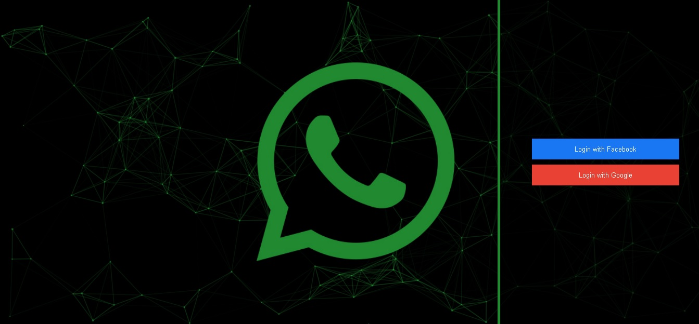
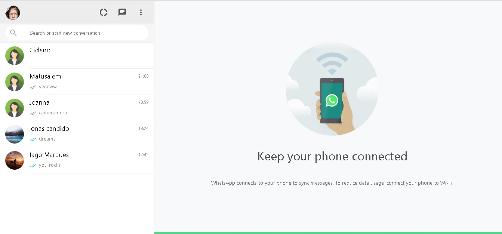
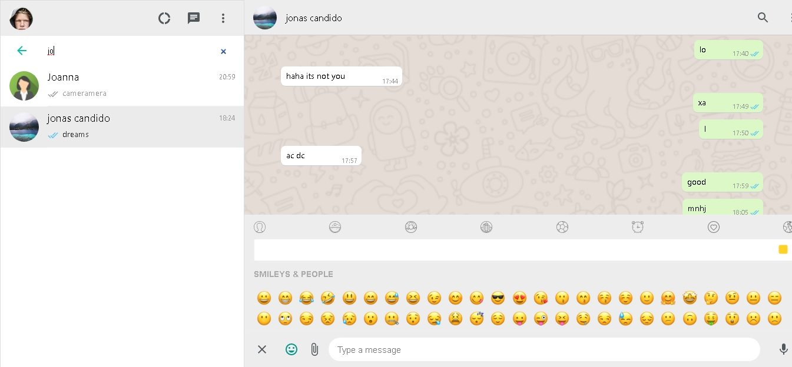

# WhatsApp Clone

## Table of contents

- [Overview](#overview)
  - [Users should be able to](#users-should-be-able-to)
  - [Screenshots](#screenshots)
  - [Built with](#built-with)
- [Author](#author)
- [Acknowledgments](#acknowledgments)
- [Future customizations](#future-customizations)

## Overview

### Users should be able to:

- Log in using a Facebook or Google account
- Start new chat
- Exchange messages in real-time through text, emoji, images, videos and audios
- See if his message was already seen by other users
- See the last message(without open any chat) and know how many messages are still pending
- Exchange text using speechRecognition
- Preview media (and abort it) before uploading

### Screenshots

## Built with

Whatsapp Clone is a Realtime Chat App made basically using React, TypeScript, Node.js, Express and Firebase. Also Multer, Sharp and Styled-Components were used.

## Heroku

- [Whatsapp Clone Page at Heroku](https://young-oasis-68738.herokuapp.com/)

## Author

- Website - [Iago D. de Oliveira Marques](https://github.com/IagodeOliveira/)

## Acknowledgments

This project was inspired on a course video at https://b7web.com.br.
- The Link to the video - (https://www.youtube.com/watch?v=BkX4niTo9Ow)

## Future customizations

### In the near future I intend to add the following customizations:

- Delete messages and chats
- Record your own audio
- Upload more than one media at a time
- Upload of images with subtitles/comments

